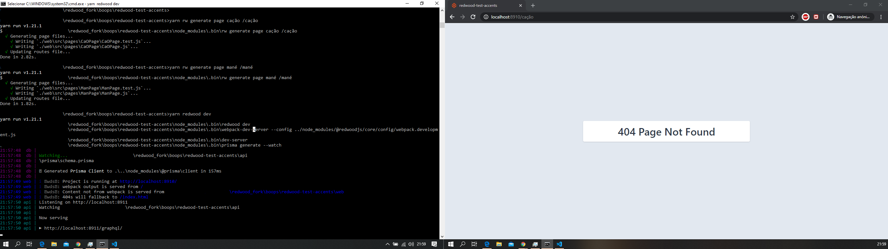

# Redwood
>**HEADS UP:** RedwoodJS is _NOT_ ready for use in Production. It relies heavily on Prisma2, which is currently in testing with an expected production release coming soon. See status at ["Is Prisma2 Ready?"](https://isprisma2ready.com)

## Getting Started
- [Redwoodjs.com](https://redwoodjs.com): home to all things RedwoodJS.
- [Tutorial](https://redwoodjs.com/tutorial/welcome-to-redwood): getting started and complete overview guide.
- [Docs](https://redwoodjs.com/docs/introduction): using the Redwood Router, handling assets and files, list of command-line tools, and more.
- [Redwood Community](https://community.redwoodjs.com): get help, share tips and tricks, and collaborate on everything about RedwoodJS.

### Setup

We use Yarn as our package manager. To get the dependencies installed, just do this in the root directory:

```terminal
yarn install
```

### Fire it up

```terminal
yarn redwood dev
```

Your browser should open automatically to `http://localhost:8910` to see the web app. Lambda functions run on `http://localhost:8911` and are also proxied to `http://localhost:8910/api/functions/*`.

## Development

### Database

We're using [Prisma2](https://github.com/prisma/prisma2), a modern DB toolkit to query, migrate and model your database.

Prisma2 is [not ready for production](https://isprisma2ready.com) at the moment.

To create a development database:

```terminal
yarn redwood db up
```

This will read the schema definition in `api/prisma/schema.prisma` and generate a sqlite database in `api/prisma/dev.db`

If you've made changes to the schema run `yarn redwood db save` to generate a migration, and `yarn redwood db up` to apply the migration/ generate a new ORM client.


### special accents used in web

Used some special characters for page generation, more specifically `ç`, `ã` and `é`

with the following commands:
- `yarn rw generate page cação /cação` (this should have been made into cacao) in the page and router
- `yarn rw generate page mané /mané` (this should have been made into mane) into the page and router
- `yarn rw generate page mañana /mañana` (this should be made into manana) into the page and router


See the results in `web/src/pages/*`


See below for behaviour



### special accents used in api

This is a work in progress i'll be adding as i go.

